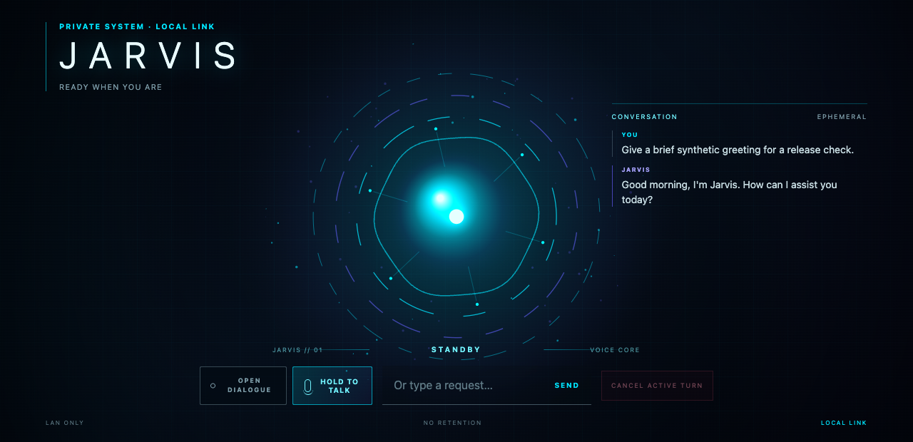
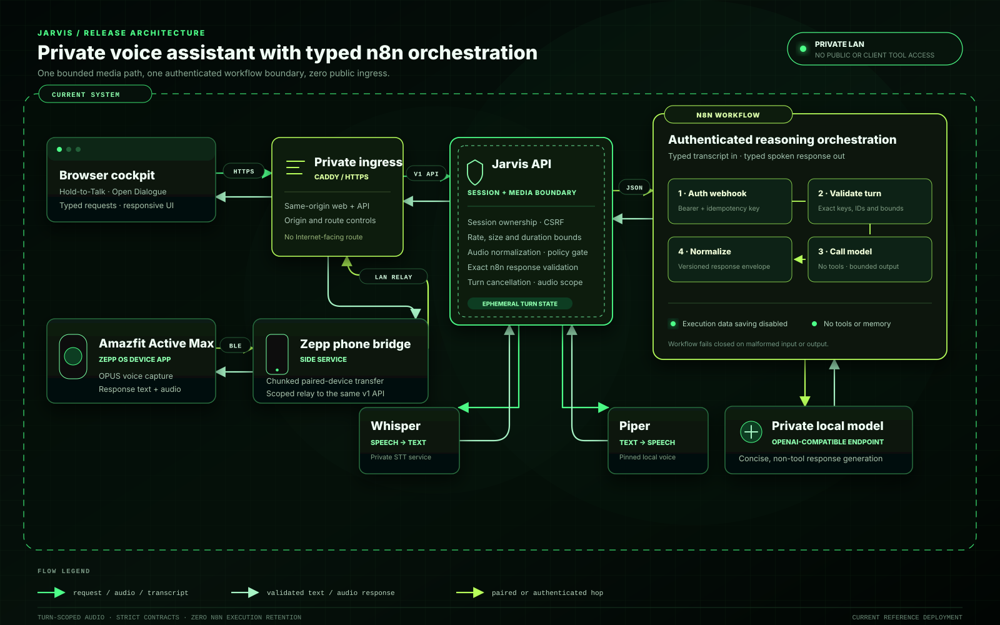
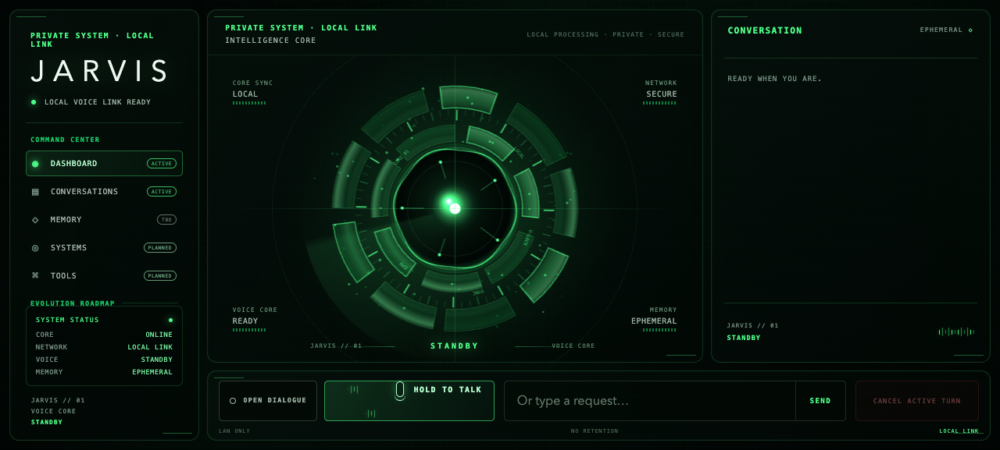
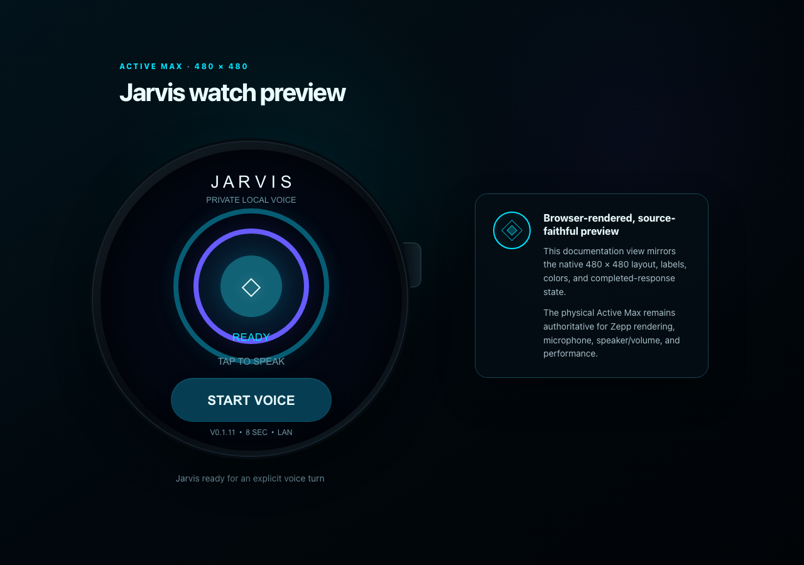

# Jarvis

> A private, local-first voice assistant that runs across the browser and a physical Amazfit Active Max.

Speak from the browser or watch. Speech recognition, reasoning, and voice playback stay inside a user-operated private stack.

**Core release:** `0.1.8` · **Watch release:** `0.1.12` · **API contract:** `v1` · **Deployment:** private trusted LAN only

## Portfolio film

[▶ Watch the 72-second Jarvis showcase film](docs/showcase/jarvis-showcase.mp4)

*72-second product film. Narration uses an authorized original synthetic voice generated through ElevenLabs; no character voice was cloned.*



## What happens when I speak?

1. The browser or watch captures one explicitly initiated voice turn.
2. Audio travels only to the private Jarvis API.
3. Private speech recognition creates the transcript.
4. A bounded reasoning workflow calls the configured local model.
5. Local speech synthesis returns the answer to the browser or watch.

## Architecture



A voice turn follows one controlled path:

1. The browser records directly, or the watch records OPUS and transfers it through the paired Zepp phone service.
2. The client creates a short-lived session and submits the turn through private same-origin HTTPS.
3. The Jarvis API verifies origin, session ownership, replay key, request schema, payload size, duration, concurrency, rate, and policy.
4. Audio is normalized and transcribed by the operator's private speech-recognition service.
5. The API sends only the versioned session ID, turn ID, and transcript to an authenticated n8n webhook.
6. n8n validates the exact contract, calls the configured private local model, and emits a normalized response with execution retention disabled.
7. The API independently validates that response, synthesizes speech with Piper, scopes the resulting audio to the owning session, and returns text plus audio.
8. The browser or watch plays the response and returns to standby.

Both clients share the same server-side policy and media path. The watch has no privileged API, and n8n is not used for realtime audio transport.

## Why I built it

Jarvis explores one practical question:

> Can a useful personal voice assistant span browser and wearable interfaces while keeping speech, reasoning, and response generation under local, private control?

The goal was not to imitate a cloud assistant or expand into an unrestricted agent. It was to make one carefully bounded voice path useful enough to run from a browser and wear on a real device—while keeping listening explicit, state ephemeral, contracts inspectable, and private services private.

## What this demonstrates

- Local-first AI architecture
- Browser and wearable interface design
- Explicit microphone activation and bounded voice turns
- Shared, versioned API contracts
- Authenticated n8n orchestration with zero execution retention
- Private local-model integration
- Local speech recognition and synthesis
- Fail-closed security and policy boundaries
- Physical-device build, installation, and testing discipline

> [!IMPORTANT]
> Jarvis is not a turn-key cloud service or public demo. A working clone requires operator-supplied STT, TTS, reasoning, HTTPS ingress, and—when using the watch—a paired phone and Amazfit Active Max. No GitHub Pages site, public API, hosted model, or marketplace package is provided.

## Interface evidence

### Browser cockpit



The browser supports Hold-to-Talk, deliberate Open Dialogue, and typed requests. The mechanical core visualizes idle, listening, processing, speaking, and error states; reduced-motion and responsive layouts are included.

### Active Max watch

| Active Max interface | Watch experience |
|---|---|
|  | **Explicit voice control.** Tap **Start Voice**, speak for up to eight seconds, then tap again or let recording stop automatically.<br><br>**Private response path.** Audio travels through the paired phone to the user-operated private stack; response text and MP3 playback return to the watch.<br><br>**Clear lifecycle.** The ring and status label distinguish ready, listening, processing, speaking, and error states. |

This is a browser-rendered, source-faithful documentation preview. It is not a photograph of the device. The physical Active Max remains authoritative for Zepp rendering, microphone, speaker/volume, and performance.

## Release details

- **Terminal-green browser cockpit** with a dimensional mechanical intelligence core, truthful module states, responsive controls, and reduced-motion support.
- **n8n reasoning orchestration** through one authenticated, typed webhook path: validate turn → call private local model → normalize response.
- **Zero n8n execution retention** for successful, failed, manual, or in-progress executions in the supplied workflow.
- **Shared browser/watch API** with origin checks, session ownership, idempotency, cancellation, strict media limits, and ephemeral response audio.
- **Jarvis Watch `0.1.12`** with the validated terminal-green mechanical presence animation, static failure-safe render, matching app icon, reusable-recorder recovery, bounded STOP-event watchdog, stale-callback fencing, and response-volume restoration.
- **Bounded reasoning scope:** no tools, Home Assistant, memory service, search, or direct fallback in the selected n8n path. The current workflow generates concise spoken responses only.

## Engineering details

### Browser

- Hold-to-Talk with pointer, <kbd>Space</kbd>, or <kbd>Enter</kbd>; release sends the recording.
- Open Dialogue, explicitly enabled by the user, with local voice-activity detection.
- Half-duplex conversation: capture pauses while a request is processed or Jarvis is speaking.
- Typed requests, bounded on-screen conversation history, turn cancellation, and response playback.
- Three-minute Open Dialogue silence timeout and 12-second maximum browser utterance.

### Amazfit Active Max

- Zepp OS Device App plus phone Side Service for the round 480 × 480 `genevaw` target.
- Tap-to-start/tap-to-stop OPUS recording with an eight-second maximum.
- Bounded, chunked transfer from watch to phone, then relay to the same private `v1` API.
- MP3 response transfer, on-watch playback, response text, and low-power state animation.
- Response-only volume attenuation to 85% of current watch volume, followed by restoration.
- Reusable recorder with recovery when `stop()` throws or Zepp omits or delays its STOP event.
- Microphone-only app permission in the current manifest.

### API and media contracts

- Browser WebM/Opus, watch OPUS, and WAV input normalize to mono 16 kHz WAV.
- The same `v1` API owns browser and watch sessions, request validation, media bounds, policy, cancellation, and response ownership.
- Whisper-compatible private speech recognition and Piper synthesis with `en_US-danny-low`.
- WAV output for browsers and MP3 output for the watch.
- The executable contract is documented in [`docs/openapi.yaml`](docs/openapi.yaml).

### n8n reasoning contract

- Authenticated API-to-n8n transport with exact request keys, bounded identifiers, idempotency, and response-size limits.
- Four nodes: authenticated webhook, strict turn validation, private model call, and typed response normalization.
- Exact response-envelope validation at the Jarvis API before speech synthesis.
- Sanitized workflow artifact: [`n8n/Jarvis Watch & Web.workflow.json`](n8n/Jarvis%20Watch%20%26%20Web.workflow.json).
- Versioned schemas: [`request.schema.json`](contracts/n8n/v1/request.schema.json) and [`response.schema.json`](contracts/n8n/v1/response.schema.json).

## Privacy and security model

Jarvis is designed for a trusted private network, not anonymous Internet exposure.

- **Local reachability:** no public route, hosted demo, analytics integration, or client credential flow.
- **Explicit listening:** browser capture requires Hold-to-Talk or deliberate Open Dialogue; watch recording begins only from its on-screen control.
- **Ephemeral server state:** sessions, transcripts, bounded turn state, and response audio expire; audio normalization uses temporary directories removed after processing.
- **Zero n8n execution retention:** the supplied workflow disables successful, failed, manual, and progress data retention.
- **Client isolation:** restrictive Content Security Policy, same-origin API calls, no-referrer behavior, and no third-party scripts or assets.
- **Request authorization:** short-lived session IDs, session-bound CSRF tokens, idempotency keys, and ownership checks.
- **Fail-closed contracts:** malformed n8n requests or responses, unknown keys, mismatched IDs, oversized text, and unavailable services reject the turn.
- **Policy before reasoning:** high-risk physical, security, purchase, and irreversible intents are rejected before the reasoning workflow or synthesizer.
- **Credential boundary:** n8n and model credentials remain in server-side file mounts or n8n credentials; they are not shipped in browser/watch bundles or the sanitized workflow.
- **Hardened containers:** non-root users, read-only filesystems, dropped capabilities, no-new-privileges, bounded temporary storage, and no published host ports.
- **Safe errors:** routine client errors and logs omit upstream bodies, credentials, transcripts, audio, and local filesystem details.

These controls do **not** make the current build safe for direct Internet exposure. Account authentication, device credential issuance and revocation, and a public-ingress security review remain separate future gates. See [SECURITY.md](SECURITY.md) for the supported deployment and private reporting path.

## Prerequisites

- Node.js 20 and npm.
- Python `3.11.x` (`>=3.11,<3.12`).
- `ffmpeg`, `ffprobe`, and `libopus` for the API runtime.
- Private speech-to-text and text-to-speech HTTP endpoints compatible with the source contracts.
- Either:
  - an authenticated n8n webhook plus private OpenAI-compatible model configured in n8n; or
  - the supported direct private OpenAI-compatible backend for non-n8n deployments.
- A trusted HTTPS origin serving `web/` and routing same-origin `/api/v1` requests to the API.
- For watch use: Zeus CLI, Zepp mobile app Developer Mode, a paired Amazfit Active Max, and phone-to-API reachability on the same private network.

The included Compose file intentionally publishes no host ports. It supports a local named network by default and can join an operator-managed external network through environment configuration.

## Local setup

### 1. Install JavaScript dependencies

```bash
npm ci
```

### 2. Create the API environment

```bash
cd api
python3.11 -m venv .venv
source .venv/bin/activate
python -m pip install --upgrade pip
python -m pip install -e '.[test]'
cd ..
```

### 3. Configure private upstreams

Copy [`.env.example`](.env.example) to an untracked environment file.

For the n8n path:

```text
JARVIS_REASONING_BACKEND=n8n
JARVIS_N8N_WEBHOOK_URL=<private authenticated webhook URL>
JARVIS_N8N_API_KEY_FILE=<absolute path to a mode-0600 credential file>
```

Also set the private STT/TTS URLs, exact HTTPS browser origin, and `JARVIS_PIPER_VOICE=piper:en_US-danny-low`. Leave direct reasoning URL/model/key values unset when n8n is selected; configuration fails closed if both paths are mixed.

The checked-in n8n workflow is sanitized. Replace its placeholder model URL, model identifier, and credential references inside your n8n environment before import or activation. Do not commit the resulting runtime workflow export.

### 4. Run the API and web client

With the environment loaded:

```bash
cd api
source .venv/bin/activate
jarvis-api
```

Serve `web/` from the trusted HTTPS origin and reverse-proxy `/api/` to the API. A healthy API returns:

```json
{"status":"ready","api_version":"v1"}
```

from `GET /api/v1/health`.

## Build and test

```bash
npm test
npm run test:api
npm run validate:publication
npm run public-safety
npm run media-safety
docker compose config
```

Or run the complete repository gate:

```bash
npm run verify
```

Build the Active Max package after installing and authenticating Zeus CLI:

```bash
npm run build:watch
```

The suites exercise JavaScript contracts, Python API behavior, real media conversion/decoding, n8n adapter and workflow schemas, publication links/assets, secret-safe text boundaries, and media-release safety. Automated media scanning is defense in depth, not a substitute for the [human visual-release checklist](docs/PUBLIC_MEDIA_CHECKLIST.md).

## Install on Amazfit Active Max

The supported development path is source → Zeus preview → QR code → Zepp mobile app → paired watch.

1. Copy `watch/.env.local.example` to `watch/.env.local` and set a phone-reachable private API origin. Keep the file mode `0600`.
2. Run `npm run build:watch` from the repository root.
3. From `watch/`, run `zeus preview --target "Amazfit Active Max"`.
4. In the Zepp app, enable Developer Mode through **Profile → Settings → About → tap the Zepp icon seven times**.
5. Use **Profile → Settings → Developer Mode → Scan** and scan the temporary preview QR from a second screen.
6. Validate repeated voice turns, failure recovery, volume restoration, back/close behavior, and relaunch on the physical watch.

Preview QR codes are temporary credentials. Do not publish or commit them. A successful package build is not the same as physical-device acceptance.

## Current limitations

- No public web demo, API, GitHub Pages deployment, or marketplace package.
- A clone cannot answer until the operator supplies and secures STT, reasoning, n8n when selected, and TTS services.
- The watch Side Service needs an operator-specific private API origin at build time.
- Open Dialogue is explicit, browser-only, half-duplex, and energy-threshold based—not wake-word listening or full-duplex streaming.
- Watch capture begins from the on-screen button; physical-button activation is not implemented.
- The current n8n release has no tools, Home Assistant, memory service, search, or direct fallback in the selected path.
- Sessions and conversation state are process-local and ephemeral; restarting the API clears them.
- The local build does not issue or revoke per-device credentials and must not be exposed directly to the Internet.
- Browser, automated contract, package, and physical-device checks are distinct evidence levels; the physical Active Max remains authoritative.
- No physical-device photo or recorded real-turn video is included in this release; the watch image above is explicitly browser-rendered documentation evidence.

## Project structure

```text
.
├── api/                 aiohttp API, media pipeline, n8n adapter, and Python tests
├── contracts/n8n/v1/    versioned n8n request and response schemas
├── docs/
│   ├── architecture/    current n8n-based release diagram
│   ├── screenshots/     browser and watch documentation states
│   ├── showcase/        portfolio-film contract and release media
│   ├── watch-preview/   deterministic source-faithful watch renderer
│   └── openapi.yaml     shared v1 client contract
├── n8n/                 sanitized zero-retention reasoning workflow
├── tests/js/            browser, watch, protocol, metadata, container, and safety tests
├── watch/               Zepp OS Device App, phone Side Service, and manifest
├── web/                 responsive browser cockpit and hardened web container
├── compose.yaml         private, non-published container deployment
└── ROADMAP.md           current baseline and planned work
```

## Name and affiliation

Jarvis is an independent, unofficial personal engineering project. It is not affiliated with or endorsed by Marvel Entertainment, The Walt Disney Company, or related rights holders. The repository includes no Marvel or Disney artwork, logos, copied interface assets, quotes, sounds, or cloned character voices.

## Contributing

Changes should preserve the shared API boundary and keep product claims tied to executable or physical-device evidence.

- Add or update tests with behavior changes; run JavaScript, Python, publication, public-safety, and media-safety gates.
- Keep watch version, package metadata, preview footer, screenshot, and assertions synchronized.
- Never commit credentials, private network coordinates, preview QR/session URLs, audio, transcripts, or recorded private turns.
- Keep n8n requests and responses versioned, exact, bounded, authenticated, and independently validated by the API.
- Treat browser verification, documentation preview, package build, and physical-watch acceptance as distinct evidence levels.
- Update [ROADMAP.md](ROADMAP.md) when work moves between planned, in progress, and verified.

<!-- Maintainers: when behavior or release metadata changes, update manifest/version assertions, README status and limitations, architecture/docs, and screenshots together. -->
